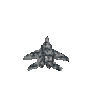

# Improved Adversarial Systems for 3D Object Generation and Reconstruction:
This is a repository for the paper "Improved Adversarial Systems for 3D Object Generation and Reconstruction". 
There are three GAN projects held here. The first, held in the folder 3D-Generation, is code for generating 
3D objects. The second, held in the folder 3D-reconstruction-Image, is code for producing 3D objects when 
conditioned on image inputs. The third, held in the folder 3D-reconstruction-Kinect, is code for reconstructing 
3D objects, from single perspective depth scans. 

A diagram outlining the 3 Generative Adverserial Networks used in this repo. 

# Example 3D Generation 

Example 3D objects generated from a distribution constisting of 10 3D object classes in 12 orientations, rotated for easy viewing. 

  
Comparison of 3D-IWGAN's generation ability compared to that of 3D-GAN's.

# Reference:
please cite my paper if you use this repo for research https://arxiv.org/abs/1707.09557
# New Work: 
Please check out my new paper's repo [here](https://github.com/EdwardSmith1884/Multi-View-Silhouette-and-Depth-Decomposition-for-High-Resolution-3D-Object-Representation) if you have an interest in 3D generation and reconstruction. 
Example Reconstruction: 

  

  

An example reconstruction result from a single image.
